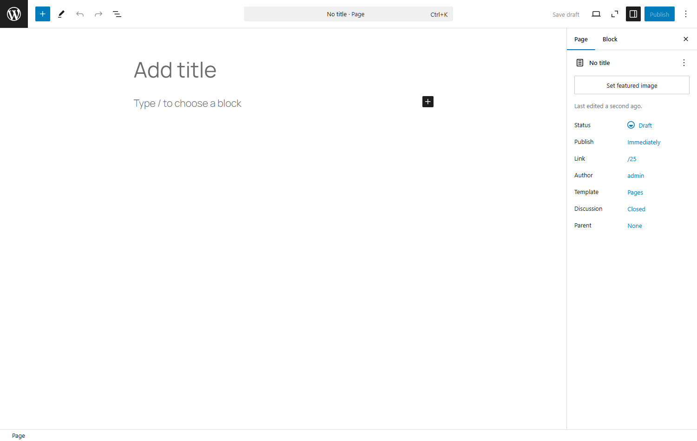
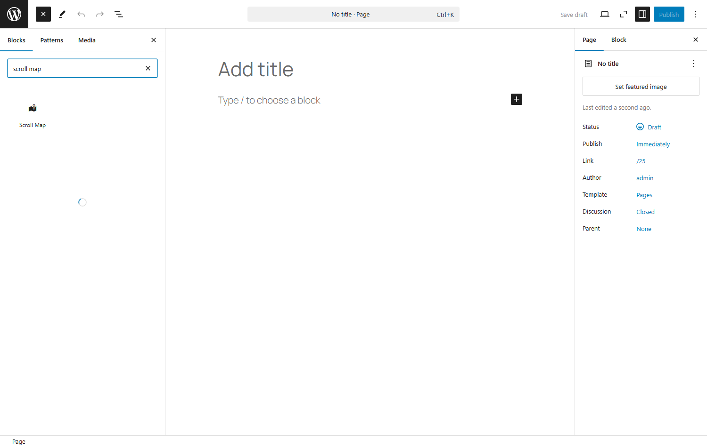
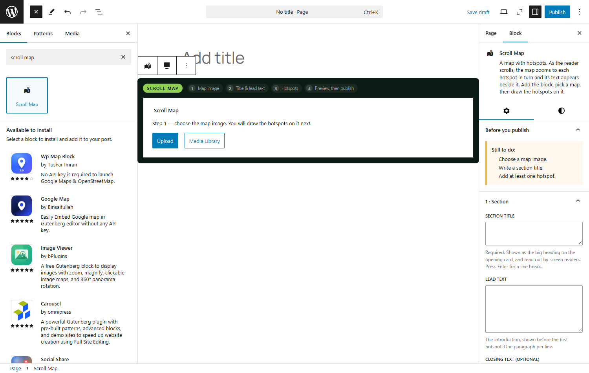
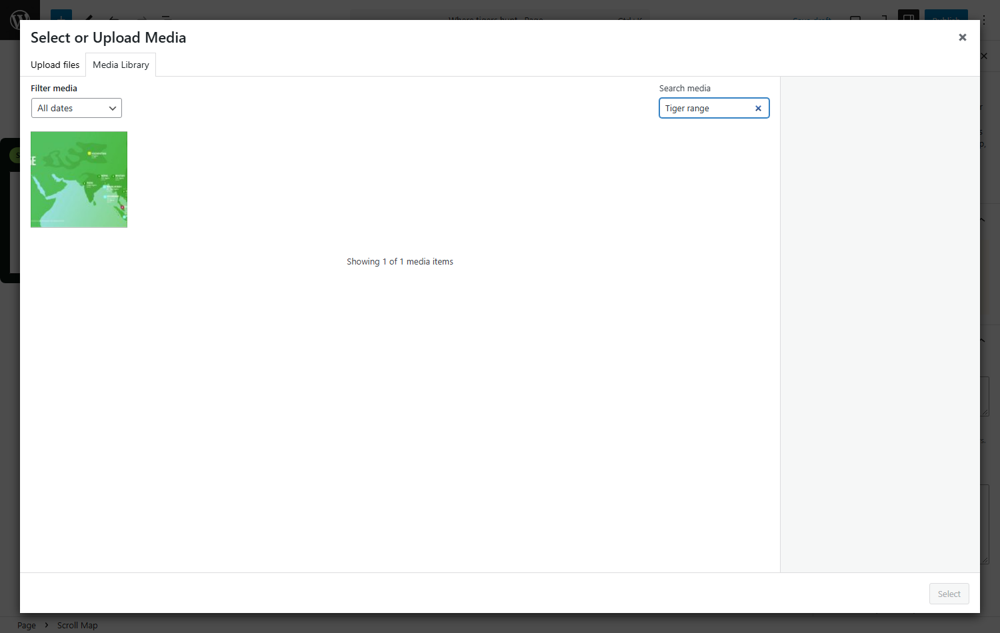
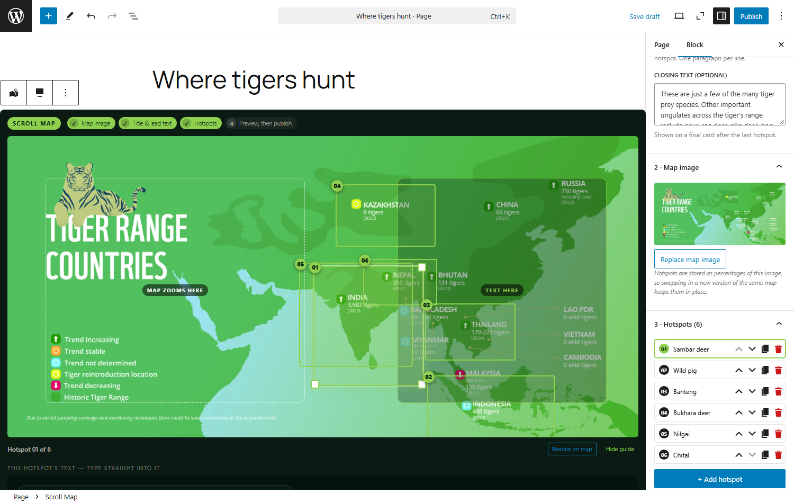
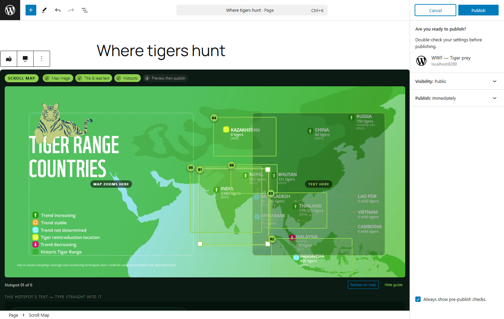
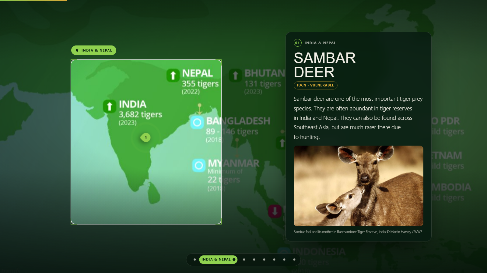

# Adding the map to a new page — click by click

Every step below was performed on the running demo site and screenshotted; the pictures are
in `research/shots/howto-*.png`. The page it produced is
**http://localhost:8280/?page_id=29** ("Where tigers hunt").

---

> **This assumes the plugin is already installed.** If `/scroll map` finds nothing, the
> plugin is not on that site yet — see [09-INSTALLING.md](09-INSTALLING.md).

## Before you start

You need **one picture** — the map, floor plan, diagram or illustration you want to walk
readers around. Upload it to the Media Library first if it isn't there, and give it **alt
text** while you're in there.

---

## Step 1 · Make the page

**Pages → Add New Page**, and type a title (`Where tigers hunt`).

## Step 2 · Insert the block

Two ways — either is fine:

| | How |
|---|---|
| **Fastest** | On the empty line under the title, type `/scroll map` and press **Enter** |
| **Browsing** | Click the **+** at the top left, type `scroll map`, click **Scroll Map** |

> If you see a list headed **"Available to install"** with other map plugins underneath,
> ignore it — that's WordPress offering plugins from the directory. **Scroll Map** is the one
> at the top, under *Blocks*.

## Step 3 · Choose the map image

The block starts as a placeholder that asks for exactly one thing:

> **Step 1 — choose the map image. You will draw the hotspots on it next.**
> **[ Upload ]  [ Media Library ]**

Notice two things that will guide you the rest of the way:

- the **four-step strip** across the top of the block — `① Map image ② Title & lead text
  ③ Hotspots ④ Preview, then publish` — which ticks itself off as you go;
- **Before you publish** in the right-hand panel, listing what's still missing.

Click **Media Library**, search for your map, select it, **Select**.

Step ① ticks green and the map fills the block.

---

## Step 4 · Now choose your route

### Route A — start from the finished example (30 seconds)

In the sidebar, panel **3 · Hotspots**, click **Or load the tiger example**.

That fills in the section title, the lead text, the closing text, all six hotspots with their
regions already drawn — **and goes and finds the six photos in the Media Library and attaches
them**. All three steps tick green and you have a complete, working map.

Then edit it into your own content: click a hotspot row, retype its title and text, swap its
photo, drag its box somewhere else. This is the fastest way to learn the block.

*(The link only appears while the block has no hotspots yet — it will never overwrite your
work.)*

### Route B — build it yourself

**4a. Write the words.** Sidebar panel **1 · Section**:

| Field | What to put |
|---|---|
| **Section title** | *Required.* The big heading on the opening card. Press **Enter** to break the line where you want it |
| **Lead text** | Your introduction. **One paragraph per line** |
| **Closing text** | Optional, shown after the last hotspot |

Step ② ticks green.

**4b. Add the first hotspot.** Panel **3 · Hotspots** → **+ Add hotspot**.

It drops you straight into drawing mode — **drag a box on the map** over the place you want.
Release, and the box is saved.

**4c. Give it its words.** Scroll to the **card preview underneath the map** and type the
title and the text right into the card, as it will look. Then in the sidebar:

| Field | What it does |
|---|---|
| **Location label** | Short place name, e.g. `India & Nepal`. Shows on the badge over the map |
| **Which side is the text on?** | The map always zooms to the *opposite* half, so text never covers the place |
| **Add an image** + **Caption / credit** | Optional photo for this hotspot |

**4d. Repeat.** **+ Add hotspot** for each place. Step ③ ticks green once every hotspot has
some text.

---

## Step 5 · Adjust the hotspots

On the map itself, with a hotspot selected:

- **Move it** — drag the box from its middle
- **Resize it** — drag one of the four white corners
- **Pick another one** — click its round numbered badge (badges stay clickable even where
  boxes overlap)
- **Redraw it** — the **Redraw on map** button under the map

In the **3 · Hotspots** list: **↑ ↓** reorder, **⧉** duplicate, **🗑** remove. Numbering
follows the order automatically, so reordering needs no other change.

The **layout guide** (toggle under the map) draws a dashed box where the map will zoom to and
a green box where the text will sit — always opposite each other.

---

## Step 6 · Preview, then publish

1. **Preview → Desktop / Tablet / Mobile** in the top bar.
2. **Preview → Preview in new tab** — the real page, as a visitor will see it, while still a
   draft. Scroll it end to end.
3. **Publish.**

The result:

### If Publish is greyed out

**Before you publish** lists exactly what's missing:

| It says | Do this |
|---|---|
| Choose a map image | Panel **2 · Map image** |
| Write a section title | Panel **1 · Section** |
| Add at least one hotspot | Panel **3 · Hotspots** → **+ Add hotspot** |
| Hotspot *nn* — give it a title or some text | That one is empty. Write something, or delete it |

Rows with a problem are outlined red in the hotspot list too.

---

## Starting completely fresh

If you delete every page, **nothing about the block breaks** — it's a plugin, not content.
Your images stay in the Media Library, so **Route A above still works** and rebuilds the whole
map in one click.

To reset the whole demo site back to how it shipped, see
[`../src/wp-plugin/README.md` §1.4](../src/wp-plugin/README.md).

---

## Two things people ask

**Can I have more than one map on a page?** Yes — insert the block again. Each keeps its own
content and settings, and the shared code is loaded once.

**Can I reuse the same map on another page?** Select the block → **⋮** → **Copy**, then paste
into the other page. Or save it as a **synced pattern** so editing it once updates it
everywhere.
