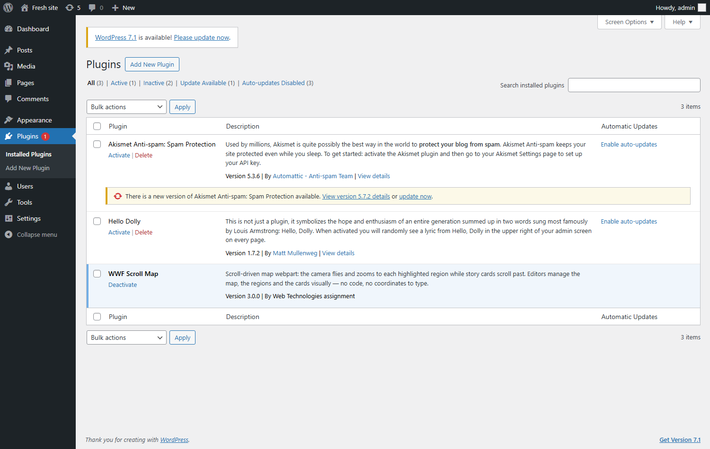

# Installing it — "where did `/scroll map` come from?"

The honest answer to the question an interviewer will ask.

---

## 1. Why `/scroll map` works at all

It is **not** part of WordPress. Typing `/scroll map` finds the block because the plugin is
installed and active, and on every page load the plugin runs one line:

```php
register_block_type( __DIR__ );          // wwf-scrollmap.php
```

That reads `block.json`, which carries the block's name, title, icon, description and
keywords. WordPress puts it in the **+ inserter** and in the `/` slash menu, and wires up its
editor script, its stylesheet, its front-end script and its server renderer.

On a WordPress where the plugin is **not** installed, `/scroll map` finds nothing — you'd get
WordPress's "Available to install" suggestions for other people's map plugins instead. (You
can see exactly that in `research/shots/howto-3-placeholder.png`, in the left-hand column.)

So the real question is: **how does the plugin get onto a site?**

---

## 2. Onto an empty WordPress

### Build the installable file

```
node tools/sync-core.js          # copy src/core into the plugin
node tools/build-plugin-zip.js   # → dist/wwf-scrollmap-3.0.0.zip   (84 KB, 12 files)
```

The build refuses to produce a zip if anything essential is missing — no `Plugin Name:`
header, a `block.json` pointing at a file that is not in the package, a missing `render.php`.
Better to fail on my machine than on a client's server.

### Install it — three routes, same result

**A · The normal one (no shell, no developer).**

1. **Plugins → Add New Plugin**
2. **Upload Plugin** (button at the top)
3. Choose `wwf-scrollmap-3.0.0.zip` → **Install Now**
4. **Activate Plugin**



**B · WP-CLI**, for a deploy script or a managed host:

```bash
wp plugin install wwf-scrollmap-3.0.0.zip --activate
```

**C · Copy the folder**, for SFTP or a git-deployed site: put
`src/wp-plugin/wwf-scrollmap/` into `wp-content/plugins/`, then activate it in **Plugins**.
This is also what the local Docker stack does — it bind-mounts the folder, which is why
editing a file on your machine changes the running site with no rebuild.

### Check it landed

```bash
wp eval-file src/wp-plugin/check-install.php
```

```
OK   plugin active
OK   block registered: "Scroll Map", keywords: map, hotspot, scroll, story, zoom, wwf
OK   script handle "gsap" registered
OK   script handle "gsap-scrolltrigger" registered
OK   block renders (1643 bytes, 2 steps)
Success: Install is good — "/scroll map" will now work in the page editor.
```

### Proving it on a genuinely empty site

The dev stack has the plugin bind-mounted, so it can't prove anything about installing. There
is a second, completely empty WordPress for exactly this:

```bash
cd src/wp-plugin
docker compose -f docker-compose.clean.yml up -d      # → http://localhost:8281
```

Nothing is mounted into it. Install the zip, and `Scroll Map` appears in its inserter — that
screenshot above is from that site. Tear it down with
`docker compose -f docker-compose.clean.yml down -v`.

> **One packaging bug this caught.** The first build used PowerShell's `Compress-Archive`,
> which writes **backslashes** as the path separator inside the zip. The ZIP spec requires
> forward slashes, so PHP on Linux saw one flat file called `wwf-scrollmap\block.json`
> instead of a folder, installed it as `wwf-scrollmap-3.0.0/wwf-scrollmap/`, and the plugin
> would not load. Invisible on a Windows dev machine, fatal on a real server. The build now
> writes the zip itself — see [`tools/lib/zip.js`](../tools/lib/zip.js).

---

## 3. The plugin is not the content

Installing the plugin gives an editor an **empty** block to use. It does not bring any tigers
with it. Content moves separately:

| To move | How |
|---|---|
| One block | Select it → **⋮ → Copy**, paste into the other page. Works across sites |
| A whole page | **Tools → Export** (WXR) on the old site, **Tools → Import** on the new. Images come too |
| The demo content | `wp eval-file seed-demo.php` — imports the 7 images and publishes the page |
| Content from elsewhere | Write a script that builds the attribute array and calls `serialize_block()`. `seed-demo.php` is that worked example |

There is also a one-click path for a demo: install the plugin, add the block, pick a map, then
**Or load the tiger example** in the Hotspots panel. It fills in the text and six hotspots and
finds the photos in the Media Library — see [08-ADD-TO-A-PAGE.md](08-ADD-TO-A-PAGE.md).

---

## 4. Onto a CMS that isn't WordPress

"Install the plugin" means something different in each, but the thing being installed is
always the same four files from [`src/core/`](../src/core/) plus an adapter.

| CMS | What you install | How |
|---|---|---|
| **WordPress** | the plugin zip | Plugins → Upload Plugin → Activate |
| **Drupal** | copy `src/core/` into your theme's `css/` and `js/`, declare it in `THEME.libraries.yml`, add the Paragraph types and the Twig template | `drush cr`. See [`src/adapters/drupal-twig/README.md`](../src/adapters/drupal-twig/README.md) |
| **SharePoint** | `gulp bundle --ship && gulp package-solution --ship` → upload the `.sppkg` to the tenant **App Catalog** → add the app to the site. Put `src/core/` in the site's `SiteAssets/scrollmap/` | See [`src/adapters/sharepoint-spfx/`](../src/adapters/sharepoint-spfx/) |
| **Headless / any JSON API** | serve `src/core/` as static files (your CDN, `/public`, or publish it as an npm package) | Then three script tags and a `<div data-tgr-src="#json">`. See [`src/adapters/headless/`](../src/adapters/headless/) |
| **Anything else** | the same four files | Map your content onto [`scrollmap.schema.json`](../src/core/scrollmap.schema.json) and pick server-render or JSON-render |

🗣 **The line to say out loud:** *"There is no 'porting' step. The webpart is `src/core/` —
a schema, a stylesheet and an engine, with no CMS in it. Installing it anywhere means serving
four static files and writing the adapter that maps that CMS's fields onto the schema. On
WordPress that adapter is a plugin zip; on SharePoint it's an .sppkg; headless, it's nothing
at all."*

### How I'd keep it maintainable across several CMSs

- `src/core/` is the single source. Every adapter's copy is generated by
  `node tools/sync-core.js`, and `--check` fails CI if one has drifted.
- `node tools/check-parity.js` renders the same content through WordPress's PHP, the browser
  and Node and asserts all three produce the same webpart. An adapter that drifts from the
  contract fails the build.
- In a real org I would publish `src/core/` as a versioned npm package and a Composer
  package, and have each adapter depend on a version range rather than copying — same idea,
  with a package manager doing the copying.

---

## 5. Uninstalling

**Plugins → Deactivate → Delete.** The pages that used the block keep their content — the
block markup stays in the post, it simply stops rendering (WordPress shows nothing for an
unregistered block). Reinstall the plugin and every page works again, because the content
lives in the post, not in the plugin.
